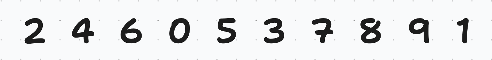
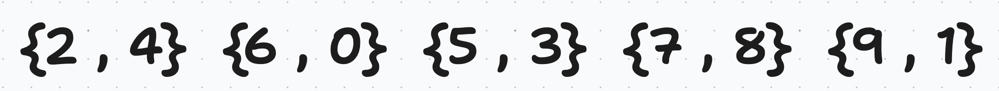
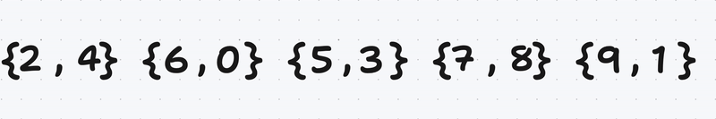
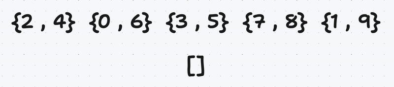
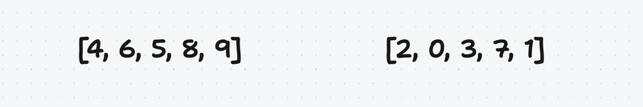

# Ex02 : Ford Johnson Sort :

### Disclaimer: The following is a brief explanation and does not reflect the actual implementation (Check Resources Below)

We Have a unsorted vector (or any container) :

We create a vector of pairs of unsigned integers (because the value to be inserted are positives) 

Then we take a vector of pairs of unsigned integers and swaps the first and second elements if the first element is greater than the second element

After that we take a vector of pairs of unsigned integers and extracts the second element of each pair into a new vector called the largest and the first element of each pair into a new vector called smallest.

It’s up to you to choose which one to sort, i choose the largest and
you need to sort them use Recursively sort 

Now start to insert the elements of largest to smallest by using lower_bound to get its position and the member function insert to insert.

